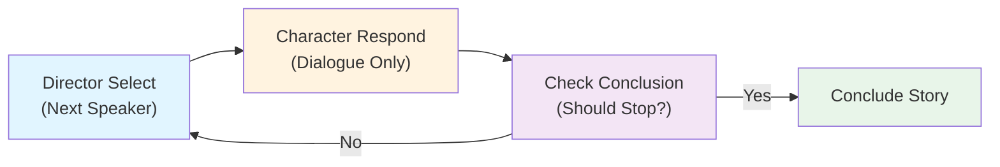
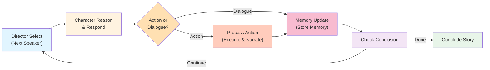
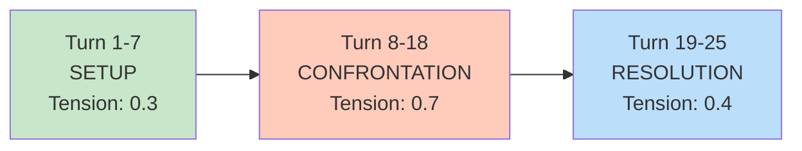
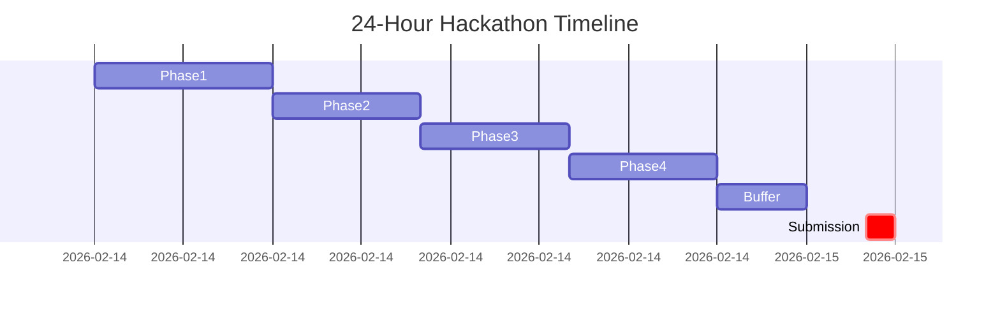
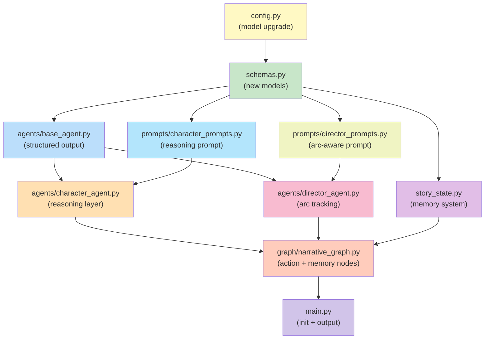
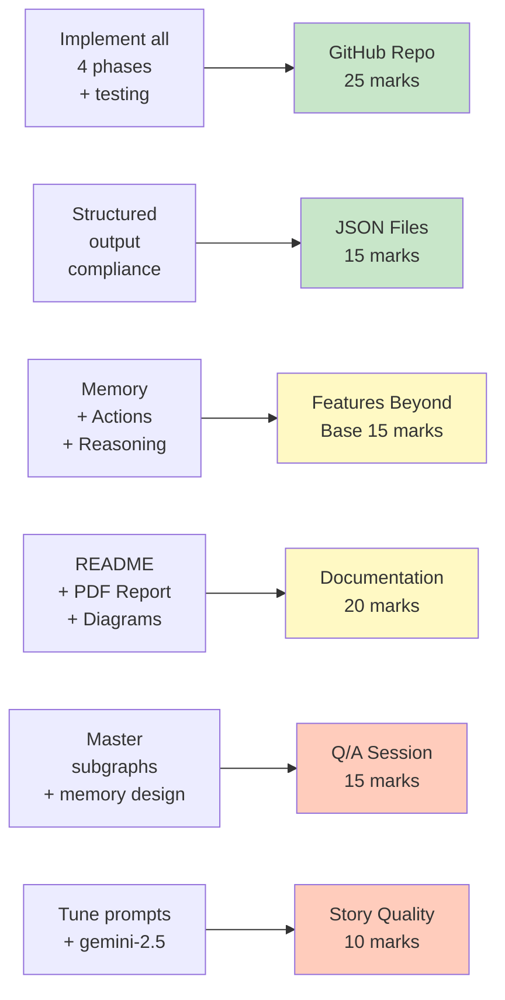

# Multi-Agent Narrative System — Hackathon Implementation Plan

## Executive Summary

**Challenge:** Implement a Multi-Agent Narrative System for Hackfest x Datathon 2026 (GenAI module) extending the provided LangGraph starter codebase.

**Current State:** A minimal 4-node loop with dialogue-only agents. No character memory, no action system, no reasoning layer.

**Deliverable:** A working system with mandatory features + bonus differentiators, clean code, comprehensive documentation, and a compelling narrative output.

**Timeline:** 24-hour hackathon (~18-20 hours active work)

**Total Marks:** 100
- GitHub Repo & System (25) 
- JSON Compliance (15) 
- Feature Implementation Beyond Base (15) 
- Documentation & Report (20) 
- Q/A Session (15) 
- Story Narration Quality (10)

---

## Current Architecture



**What's Missing:**
- ❌ Character Memory (per-character knowledge, inventory, relationships)
- ❌ Action System (≥5 non-verbal actions that mutate state)
- ❌ Reasoning Layer (think before deciding to talk or act)
- ❌ Emotion tracking, relationship graphs, story arc awareness
- ⚠️ JSON output uses string parsing instead of validated Pydantic models

---

## Technology Stack

| Component | Choice | Reason |
|-----------|--------|--------|
| **Graph Framework** | LangGraph 0.0.10+ | Already in codebase; excellent for multi-agent orchestration |
| **LLM Model** | `gemini-2.5-flash` | Free tier, native structured output, 1M context, superior creative writing vs `gemma-3-27b-it` |
| **Structured Output** | Pydantic + `.with_structured_output()` | Eliminates JSON parse failures; validated typed responses |
| **Memory Strategy** | Key-value (facts, inventory, goals, relationships) | Sufficient for 25-turn narratives; faster than RAG |
| **LangChain** | 0.0.x | For LLM integration and structured output |

---

## Implementation Plan — 4 Phases

### Phase 1: Foundation & Core Upgrades (5–6 hours)

#### Step 1: Model Upgrade
**File:** [src/config.py](src/config.py)

Change from `gemma-3-27b-it` (lower quality) to `gemini-2.5-flash` (free tier, superior).

**Benefits:**
- Native structured output support (`.with_structured_output()` works natively)
- 1M token context window
- Dramatically better creative narrative writing
- Still free tier compatible

#### Step 2: Extend Core Schemas
**File:** [src/schemas.py](src/schemas.py)

Add the following Pydantic models:

**CharacterMemory** — Per-character knowledge buffer:
```python
class CharacterMemory(BaseModel):
    known_facts: List[str]              # "Ahmed is late for flight"
    inventory: List[str]                # "broken mirror", "receipts"
    goals: List[str]                    # "get compensation"
    relationships: Dict[str, str]       # {"Saleem": "antagonist", "Raza": "authority"}
    emotional_state: str                # "angry", "scared", "hopeful"
    emotion_intensity: float            # 0.0 to 1.0
    location: str                       # "scene", "away", "police_station"
    witnessed_turns: List[int]          # Turns this character was present for (info asymmetry)
```

**CharacterResponse** — Structured character output with reasoning:
```python
class CharacterResponse(BaseModel):
    # Private reasoning (logged for judges, not shown to other characters)
    observation: str                    # "The car driver seems angry and wealthy"
    reasoning: str                      # "I need to get compensation. He'll pay to avoid scandal."
    
    # Decision
    action_type: Literal["talk", "act"]
    
    # Public output
    dialogue: Optional[str] = None      # What they say (if action_type == "talk")
    action_name: Optional[str] = None   # e.g., "leave_scene", "call_police"
    action_description: Optional[str] = None  # "I'm walking away from this madness"
    
    # State updates
    emotion: str                        # Current emotional state
    new_knowledge: List[str] = Field(default_factory=list)  # Facts learned this turn
```

**DirectorDecision** — Structured director output with pacing:
```python
class DirectorDecision(BaseModel):
    next_speaker: str
    narration: str                      # Environmental + situation description
    current_act: Literal["setup", "confrontation", "resolution"]
    tension_level: float = Field(ge=0, le=1)  # 0.0 to 1.0
```

**StoryAction** — Action execution and state mutations:
```python
class StoryAction(BaseModel):
    actor: str
    action_name: str                    # "inspect_damage", "offer_bribe", "leave_scene"
    target: Optional[str] = None        # Who/what is affected
    result: str                         # Narrated outcome
    state_changes: Dict[str, Any]       # {"saleem.location": "away", "evidence.found": True}
```

**EnvironmentState** — Scene state that changes:
```python
class EnvironmentState(BaseModel):
    time_of_day: str                    # Evolves: "late afternoon" → "evening" → "dusk"
    weather: str
    crowd_size: str                     # "sparse", "gathering", "large crowd"
    traffic_state: str                  # "blocked", "gridlocked", "flowing"
    objects_in_scene: List[str]         # Mutates with actions
```

**Enhance existing schemas:**

`CharacterProfile` — Add fields:
```python
class CharacterProfile(BaseModel):
    name: str
    description: str
    goals: List[str]                    # "get compensation", "avoid scandal"
    inventory: List[str]                # Starting items
    emotional_state: str = "neutral"
    relationships: Dict[str, str]       # Initial perceptions of others
```

`StoryState` — Add fields:
```python
class StoryState(BaseModel):
    # ... existing fields ...
    character_memories: Dict[str, CharacterMemory]   # Per-character memory buffers
    actions_log: List[StoryAction]                  # All actions performed
    environment: EnvironmentState                    # Scene state
    # Story arc tracking
    current_act: Literal["setup", "confrontation", "resolution"] = "setup"
    tension_level: float = 0.3
    emotion_history: Dict[str, List[Tuple[int, str, float]]]  # {char: [(turn, emotion, intensity), ...]}
    relationship_history: Dict[str, Dict[str, float]]          # How perceptions evolve
```

#### Step 3: Add Structured Output to Base Agent
**File:** [src/agents/base_agent.py](src/agents/base_agent.py)

Add new method:
```python
async def generate_structured(self, prompt: str, schema: type[BaseModel]):
    """Generate a structured response using Pydantic schema."""
    structured_llm = self.llm.with_structured_output(schema, method="json_schema")
    response = await structured_llm.ainvoke([("human", prompt)])
    # Log the interaction
    await self._log_interaction("structured", prompt, str(response))
    return response
```

**Benefits:**
- Validation: Response is guaranteed to match schema
- No JSON parsing failures
- Type-safe in the rest of the codebase
- Logging still captures requests/responses for auditing

#### Step 4: Implement Character Memory System
**File:** [src/story_state.py](src/story_state.py)

Add methods to `StoryStateManager`:

```python
def initialize_character_memories(self, character_profiles: List[CharacterProfile]):
    """Initialize per-character memory from profiles."""
    for char in character_profiles:
        self.state.character_memories[char.name] = CharacterMemory(
            known_facts=[],
            inventory=char.inventory,
            goals=char.goals,
            relationships=char.relationships,
            emotional_state=char.emotional_state,
            emotion_intensity=0.5,
            location="scene",
            witnessed_turns=list(range(0, 999))  # Starts seeing everything
        )

def update_character_memory(self, character_name: str, response: CharacterResponse, turn_number: int):
    """Update character memory after their turn."""
    memory = self.state.character_memories[character_name]
    memory.emotion = response.emotion
    memory.emotion_intensity = 0.5 + (len(response.reasoning) % 10) / 20  # Heuristic
    memory.new_knowledge.extend(response.new_knowledge)
    
    # Update relationship based on dialogue
    # (Can be simple: negative words → lower scores, positive → higher)

def get_character_context(self, character_name: str) -> str:
    """Get context visible to this character (information asymmetry)."""
    memory = self.state.character_memories[character_name]
    
    # Only include dialogue from turns they witnessed
    visible_history = [
        t for t in self.state.dialogue_history 
        if t.turn_number in memory.witnessed_turns
    ]
    
    # Build context string
    context = f"""
=== YOUR CHARACTER MEMORY ===
Known Facts: {', '.join(memory.known_facts) or 'None yet'}
Inventory: {', '.join(memory.inventory) or 'Nothing'}
Your Goals: {', '.join(memory.goals)}
Your Relationships:
{chr(10).join(f"  {other}: {perception}" for other, perception in memory.relationships.items())}
Current Emotion: {memory.emotion} (intensity: {memory.emotion_intensity:.1f}/1.0)
Your Location: {memory.location}

=== RECENT EVENTS (YOU WITNESSED) ===
{self._format_dialogue_history(visible_history[-5:])}

=== ENVIRONMENTAL STATE ===
Time: {self.state.environment.time_of_day}
Weather: {self.state.environment.weather}
Crowd: {self.state.environment.crowd_size}
Traffic: {self.state.environment.traffic_state}
Objects: {', '.join(self.state.environment.objects_in_scene)}
"""
    return context
```

**Key feature:** Information asymmetry — characters don't know what they didn't witness.

---

### Phase 2: Action System & Reasoning (4–5 hours)

#### Step 5: Implement Reasoning Layer in Prompts
**File:** [src/prompts/character_prompts.py](src/prompts/character_prompts.py)

Replace the simple prompt with:

```python
CHARACTER_REASONING_PROMPT = """You are {name}, a character in a unfolding story.

{description}

=== YOUR MEMORY AND STATE ===
{character_context}

=== CURRENT SCENE ===
{director_narration}

=== YOUR REASONING (Think Step-by-Step) ===
Before you act, think through:
1. OBSERVE: What do you notice in the scene right now?
2. GOAL: What are you trying to achieve? (from your goals list)
3. DECISION: Should you TALK (dialogue) or ACT (non-verbal action)?
   - TALK if: You need to communicate, persuade, reveal information, respond to someone
   - ACT if: Talk alone won't work. Actions include: inspect_damage, call_police, offer_bribe, 
     leave_scene, search_vehicle, block_road, show_evidence, threaten, haggle, etc.
4. ACTION: If acting, what is the action and its expected result?

=== YOUR RESPONSE ===
Respond ONLY with valid JSON (no markdown, no extra text):

{{
  "observation": "What you observe in the scene",
  "reasoning": "Your thought process (1-2 sentences)",
  "action_type": "talk" OR "act",
  "dialogue": "ONLY if action_type is 'talk' — what you say (1-3 sentences). Set to null if acting.",
  "action_name": "ONLY if action_type is 'act' — one of: inspect_damage, call_police, offer_bribe, 
                  leave_scene, search_vehicle, block_road, show_evidence, threaten, haggle. Set to null if talking.",
  "action_description": "ONLY if action_type is 'act' — describe the action (1-2 sentences). Set to null if talking.",
  "emotion": "Current emotional state (angry, scared, hopeful, sad, confused, etc.)",
  "new_knowledge": ["Fact you learned this turn", "Another fact"] 
}}

Remember: You are {name}. Stay in character. Your reasoning should reflect your goals and what you know."""
```

#### Step 6: Refactor Character Agent
**File:** [src/agents/character_agent.py](src/agents/character_agent.py)

```python
async def respond(self, character_name: str, director_narration: str, 
                  character_context: str, story_state_manager) -> CharacterResponse:
    """Generate a character response with reasoning and action decision."""
    
    profile = self.character_profiles[character_name]
    
    # Build prompt using the reasoning template
    prompt = CHARACTER_REASONING_PROMPT.format(
        name=character_name,
        description=profile.description,
        character_context=character_context,
        director_narration=director_narration
    )
    
    # Use structured output — returns CharacterResponse object directly
    response = await self.generate_structured(prompt, CharacterResponse)
    
    return response
```

The `generate_structured()` method (from Step 3) ensures the response is a valid `CharacterResponse` Pydantic model.

#### Step 7: Add Action Execution Node to Graph
**File:** [src/graph/narrative_graph.py](src/graph/narrative_graph.py)

Expand the graph with new nodes:

```python
async def _character_reason_and_respond_node(state: StoryState):
    """Character generates response with reasoning and decides talk/act."""
    # Get context visible to this character
    character_context = self.story_state_manager.get_character_context(state.next_speaker)
    
    # Get director's narration for this turn (set by director_select node)
    director_narration = state.director_notes[-1] if state.director_notes else ""
    
    # Generate structured response
    response = await self.characters[state.next_speaker].respond(
        character_name=state.next_speaker,
        director_narration=director_narration,
        character_context=character_context,
        story_state_manager=self.story_state_manager
    )
    
    # Update dialogue history
    if response.action_type == "talk":
        state.dialogue_history.append(DialogueTurn(
            turn_number=state.current_turn,
            speaker=state.next_speaker,
            dialogue=response.dialogue,
            timestamp=datetime.now(),
            metadata={"reasoning": response.reasoning}
        ))
    
    # Store action for process_action node
    state.pending_action = response if response.action_type == "act" else None
    
    return state

async def _process_action_node(state: StoryState):
    """Execute the action and narrate its effect."""
    if not state.pending_action:
        return state
    
    action_response = state.pending_action
    actor = state.next_speaker
    
    # Director narrates and validates the action
    action_prompt = f"""The character {actor} is performing an action. Describe the outcome:
    
    Action: {action_response.action_name}
    Description: {action_response.action_description}
    
    Narrate what happens (1-2 sentences). Return JSON:
    {{
      "result": "What happened"
    }}
    """
    
    director_action = await self.director.generate_structured(action_prompt, 
                                                               {"result": str})
    
    # Record action in state
    action = StoryAction(
        actor=actor,
        action_name=action_response.action_name,
        target=None,  # Could be extracted from prompt
        result=director_action["result"],
        state_changes={}  # Director determines state mutations
    )
    state.actions_log.append(action)
    
    # Update dialogue history with action event
    state.dialogue_history.append(DialogueTurn(
        turn_number=state.current_turn,
        speaker=actor,
        dialogue=f"[ACTION: {action.action_name}] {director_action['result']}",
        timestamp=datetime.now(),
        metadata={"action": action.action_name, "type": "action"}
    ))
    
    return state

async def _memory_update_node(state: StoryState):
    """Update character memories after the turn."""
    if state.pending_action:
        response = state.pending_action
    else:
        # If it was dialogue, response already captured
        # This is a simplification; in practice, extract from dialogue history
        response = None
    
    if response:
        self.story_state_manager.update_character_memory(
            state.next_speaker,
            response,
            state.current_turn
        )
    
    # Other characters witness (update their memory that character just acted)
    # This is optional but adds realism
    
    state.pending_action = None
    return state
```

Update the graph:

```python
def build_graph(self):
    workflow = StateGraph(StoryState)
    
    # Nodes
    workflow.add_node("director_select", self._director_select_node)
    workflow.add_node("character_reason_and_respond", self._character_reason_and_respond_node)
    workflow.add_node("process_action", self._process_action_node)
    workflow.add_node("memory_update", self._memory_update_node)
    workflow.add_node("check_conclusion", self._check_conclusion_node)
    workflow.add_node("conclude", self._conclude_node)
    
    # Edges
    workflow.set_entry_point("director_select")
    workflow.add_edge("director_select", "character_reason_and_respond")
    
    # Route based on action type
    def route_action(state: StoryState):
        # Check if pending_action exists (character chose "act")
        return "process_action" if state.pending_action else "memory_update"
    
    workflow.add_conditional_edges("character_reason_and_respond", route_action, {
        "process_action": "process_action",
        "memory_update": "memory_update"
    })
    
    workflow.add_edge("process_action", "memory_update")
    workflow.add_edge("memory_update", "check_conclusion")
    
    workflow.add_conditional_edges("check_conclusion", self._route_conclusion, {
        "continue": "director_select",
        "conclude": "conclude"
    })
    
    return workflow.compile()
```

**Updated Graph Visualization:**



#### Step 8: Enhance Director Agent
**File:** [src/agents/director_agent.py](src/agents/director_agent.py) and [src/prompts/director_prompts.py](src/prompts/director_prompts.py)

Director now tracks story arc and action count:

```python
async def select_next_speaker(self, state: StoryState) -> Tuple[str, str]:
    """Select which character speaks next, considering story arc and action enforcement."""
    
    # Determine current act
    if state.current_turn <= 7:
        current_act = "setup"
    elif state.current_turn <= 18:
        current_act = "confrontation"
    else:
        current_act = "resolution"
    
    # Check action enforcement: if ≤5 actions by turn 20, push toward actions
    action_count = len(state.actions_log)
    turns_remaining = 25 - state.current_turn
    enforce_action = (action_count < 5) and (turns_remaining > 3)
    
    prompt = DIRECTOR_SELECT_SPEAKER_PROMPT.format(
        dialogue_history=self._format_dialogue_history(state.dialogue_history[-10:]),
        characters=self._format_character_list(state.character_profiles),
        current_act=current_act,
        tension_level=state.tension_level,
        action_count=action_count,
        enforce_action="YES: Characters should ACT to move story forward." if enforce_action else "no",
        environment=self._format_environment(state.environment)
    )
    
    decision = await self.generate_structured(prompt, DirectorDecision)
    
    # Update state
    state.current_act = decision.current_act
    state.tension_level = decision.tension_level
    state.director_notes.append(decision.narration)
    
    return decision.next_speaker, decision.narration
```

---

### Phase 3: Bonus / Differentiation Features (4–5 hours)

#### Step 9: Emotion Tracking & Relationship Graph

**Implementation:**
- `CharacterMemory.emotion_history` tracks (turn, emotion_name, intensity) across all turns
- `CharacterMemory.relationships` is updated each turn based on dialogue sentiment
- After each character's turn, extract emotion and relationship changes from structured response
- Generate a simple relationship matrix in the final output

**Output addition to story_output.json:**
```json
{
  "metadata": { ... },
  "story_arc": {
    "act_1_turns": "1-7",
    "act_2_turns": "8-18",
    "act_3_turns": "19-25",
    "final_tension": 0.35
  },
  "emotion_history": {
    "Saleem": [
      [1, "panicked", 0.9],
      [3, "angry", 0.8],
      [7, "hopeful", 0.6]
    ]
  },
  "relationship_matrix": {
    "Saleem": {"Ahmed": -0.7, "Raza": -0.5, "Uncle Jameel": 0.2},
    "Ahmed": {"Saleem": -0.9, "Raza": 0.1, "Uncle Jameel": 0.0}
  }
}
```

#### Step 10: 3-Act Story Arc Tracking

**Already partially implemented in Step 8.** Fully realized as:



Director uses this arc to guide pacing:
- **Setup:** Introduce characters, establish conflict, build tension gradually (0.3 → 0.5)
- **Confrontation:** Peak drama, encourage actions, highest tension (0.7 → 0.8)
- **Resolution:** De-escalate, conclude satisfyingly, lower tension (0.7 → 0.3)

#### Step 11: Information Asymmetry System

Already implemented in Step 4 (`get_character_context` checks `witnessed_turns`).

**Action-triggered location changes:**

When a character performs `leave_scene`:
```python
# In _process_action_node
if action.action_name == "leave_scene":
    memory = state.character_memories[actor]
    memory.location = "away"
    memory.witnessed_turns = [t for t in memory.witnessed_turns if t <= state.current_turn]
    # Future turns won't be added to their witnessed_turns
```

#### Step 12: Enhanced Environment Simulation

**Implementation:**
- `EnvironmentState` mutates with actions
- Time progresses each turn: "late afternoon" (turns 1-8) → "evening" (9-16) → "dusk" (17-25)
- Actions add objects: `call_police` adds "police_van", `broken_mirror` becomes "mirror evidence"
- Director narration includes environmental updates

---

### Phase 4: Polish, Documentation & Testing (4–5 hours)

#### Step 13: Prompt Tuning & Test Runs

Run full 25-turn simulations (2-3 times):
1. Check that ≥5 distinct actions occur naturally
2. Verify story coherence (no contradictions, character consistency)
3. Ensure emotions evolve believably
4. Confirm all JSON outputs are valid and complete

Tune:
- `temperature` (currently 0.7) — lower (0.5) for more consistency, higher (0.9) for more creativity
- Prompt wording for clarity and action encouragement
- Director's action enforcement threshold

#### Step 14: JSON Output Compliance

Ensure [story_output.json](story_output.json) structure:

```json
{
  "metadata": {
    "title": "The Rickshaw Accident",
    "seed_story": "...",
    "characters": ["Saleem", "Ahmed Malik", "Constable Raza", "Uncle Jameel"],
    "total_turns": 25,
    "total_actions": 6,
    "story_arc_summary": "Setup → Confrontation → Resolution"
  },
  "events": [
    {
      "turn": 1,
      "type": "narration",
      "content": "...",
      "speaker": null
    },
    {
      "turn": 1,
      "type": "dialogue",
      "speaker": "Ahmed Malik",
      "content": "...",
      "metadata": {"reasoning": "..."}
    },
    {
      "turn": 3,
      "type": "action",
      "actor": "Constable Raza",
      "action_name": "offer_bribe",
      "result": "...",
      "state_changes": {}
    }
  ],
  "conclusion": {
    "reason": "Reached max turns",
    "final_state": "...",
    "resolution": "..."
  },
  "emotion_history": { ... },
  "relationship_matrix": { ... }
}
```

Ensure [prompts_log.json](prompts_log.json) captures:
- Full structured request (with schema)
- Full structured response
- Timestamps for all LLM calls

#### Step 15: Graph Visualization

Generate and include Mermaid diagram:

```bash
python -c "
from src.graph.narrative_graph import NarrativeGraph
from src.agents.director_agent import DirectorAgent
# ... setup ...
graph = narrative_graph.build_graph()
print(graph.get_graph().draw_mermaid())
"
```

Include in README and technical PDF.

#### Step 16: README.md

Complete rewrite covering:

**Setup:**
```bash
# Prerequisites
# - Python 3.11+
# - uv package manager (or pip)

# Installation
uv sync

# Environment
echo GOOGLE_API_KEY=your_api_key > .env

# Run
uv run python -m src.main
```

**Features Implemented:**
- ✅ Character Memory (individual, typed, with information asymmetry)
- ✅ Action System (≥5 distinct actions with state mutations)
- ✅ Reasoning Layer (structured chain-of-thought with inner monologue)
- ✅ Structured Output (Pydantic validation, no JSON parse errors)
- ✅ Emotion Tracking (history per character)
- ✅ Relationship Graphs (bidirectional perception updates)
- ✅ 3-Act Story Arc (narrative pacing with tension curve)
- ✅ Information Asymmetry (characters only know what they witnessed)

**Architecture Diagram:**
[Include Mermaid visualization]

**Design Decisions:**

| Decision | Rationale |
|----------|-----------|
| `gemini-2.5-flash` model | Free tier + native structured output + superior creative writing |
| Structured output over string parsing | Eliminate JSON errors; validated Pydantic objects |
| Key-value memory (not RAG) | Sufficient for 25 turns; lower latency |
| Information asymmetry | Realistic agent behavior; judges will notice the depth |
| 3-act structure | Classic storytelling; helps pacing and tension |

#### Step 17: Technical Report (LaTeX PDF)

Create `TECHNICAL_REPORT.pdf` covering:

1. **System Architecture**
   - High-level diagram
   - Node responsibilities
   - State flow

2. **Core Components**
   - Character Memory System (schema, update logic, asymmetry)
   - Action System (action types, state mutations, narration)
   - Reasoning Layer (prompt structure, decision logic, traces)

3. **Agent Interactions**
   - Director-to-Character communication
   - Memory synchronization
   - Action effects on state

4. **Narrative Pacing**
   - 3-Act structure
   - Tension curve
   - Character arc examples

5. **Technical Challenges & Solutions**
   - How we enforce ≥5 actions
   - How we avoid dialogue loops
   - How we manage context length
   - How structured output improved reliability

6. **Sample Run**
   - Full ~25-turn narrative with analysis
   - Emotion/relationship evolution
   - Action list and state changes

7. **Why This Design**
   - Alignment with evaluation criteria
   - Differentiation from baseline
   - Scalability and extensibility

---

## Implementation Timeline



**Actual timeline (assuming 18 active hours):**
- **Hours 0-6:** Phase 1 (schemas, memory, structured output)
- **Hours 6-11:** Phase 2 (action system, reasoning, graph expansion)
- **Hours 11-16:** Phase 3 (bonus features, prompt tuning)
- **Hours 16-20:** Phase 4 (testing, documentation, report)
- **Hour 20-24:** Buffer (fixes, polish, final testing)

---

## File Dependencies & Changes



---

## Evaluation Rubric Mapping



**Scoring strategy:**
- **25 marks (GitHub):** Clean, modular code + full working system from README
- **15 marks (JSON):** Structured output validates all fields; no parse errors
- **15 marks (Features):** Memory (per-char) + Actions (5+) + Reasoning (thought traces) = all 15
- **20 marks (Docs):** Excellent README + PDF with architecture diagrams + design rationale
- **15 marks (Q/A):** Deep understanding of subgraph design, memory asymmetry, why structured output
- **10 marks (Story):** Gemini 2.5 quality + prompt tuning + coherent 25-turn narrative

**Target: 95+ marks** (loses points only to subjective story quality variance)

---

## Verification Checklist

Before submission:

- [ ] **System runs end-to-end:** `uv run python -m src.main` completes all 25 turns without errors
- [ ] **Action count:** ≥5 distinct actions in [story_output.json](story_output.json)
- [ ] **Memory consistency:** Characters recall facts correctly; no hallucinated knowledge
- [ ] **Reasoning traces:** [prompts_log.json](prompts_log.json) shows inner monologue for every character turn
- [ ] **JSON validity:** Both output files have all required fields, no malformed JSON
- [ ] **Character voice:** Each character's dialogue stays consistent with their profile across all 25 turns
- [ ] **Story arc:** Clear setup (turns 1-7) → confrontation (8-18) → resolution (19-25)
- [ ] **Emotion evolution:** Emotions track believably across turns (e.g., anger decreases after resolution)
- [ ] **Relationships:** Relationship scores evolve; adversaries become friendlier or vice versa
- [ ] **Environment state:** Time advances, objects appear/disappear with actions
- [ ] **Information asymmetry:** Characters who left the scene don't know later events
- [ ] **Graph visualization:** Mermaid diagram included in README and technical report
- [ ] **README:** Setup instructions clear and tested; all features documented
- [ ] **Technical report:** PDF with architecture, memory design, reasoning explanation, sample run
- [ ] **No duplicate runs:** Each full simulation should produce different narrative (not cached)
- [ ] **Google API key:** Works with free tier, no paid model required

---

## Key Decisions

| Decision | Rationale | Impact |
|----------|-----------|--------|
| **Switch to `gemini-2.5-flash`** | Superior creative writing, native structured output, free tier | High quality output + eliminates JSON parse errors |
| **Structured output with Pydantic** | Type safety, validation, eliminates string parsing failures | Reliable system, impressive to judges |
| **Per-character memory buffers** | Enables character consistency and information asymmetry | Directly addresses mandatory requirement |
| **Reasoning trace in response** | Shows agent intelligence to judges (visible in prompts_log.json) | High marks for Feature Implementation & Q/A |
| **Action subgraph** | Elegant architecture: decide → execute → narrate → update memory | Impressive LangGraph mastery |
| **Information asymmetry** | Characters only know what they witnessed; creates realism | Deep system design; judges will notice |
| **3-act story arc** | Classic storytelling structure; improves coherence | Better Story Quality marks |
| **Emotion + relationship tracking** | Quantifies character evolution; adds depth | Bonuses for Feature Implementation |

---

## Bonus Out-of-the-Box Features

These differentiate from baseline and impress judges:

1. **Information Asymmetry** — Characters don't know what they didn't witness. If Saleem leaves the scene, he won't know what Ahmed says later. This is a sophisticated agent behavior.

2. **Structured Reasoning Traces** — Every character's inner monologue is logged. Judges can see "why" the character acted, not just "what" they did.

3. **3-Act Story Arc** — Automatic narrative pacing with tension curve. The story doesn't feel random; it has dramatic structure.

4. **Emotion + Relationship Evolution** — Quantified tracking shows character arcs. "Saleem started angry at Ahmed (score -0.9) but ended understanding (score -0.3)."

5. **Gemini 2.5 Flash with Structured Output** — Switching models and using native structured output is a practical best-practices choice that elevates reliability.

---

## Success Criteria

**Hackathon Success = Full Working Demo**

1. System runs start-to-finish without errors (25 turns)
2. All mandatory components present (Memory, Actions, Reasoning)
3. ≥5 actions executed naturally
4. Story is coherent and engaging (judges can follow it)
5. JSON outputs are valid and complete
6. README is clear and tested
7. You can explain the architecture to judges in detail

**Excellence = Bonus Features Working**

1. Emotion tracking shows believable evolution
2. Relationships change naturally across turns
3. 3-act pacing is evident
4. Information asymmetry is respected
5. Characters maintain consistent voice
6. Reasoning traces demonstrate intelligence
7. Technical report is polished and insightful

---

## Resources & References

**Official Documentation:**
- LangGraph: https://langchain-ai.github.io/langgraph/
- LangChain: https://python.langchain.com/
- Pydantic: https://docs.pydantic.dev/
- Google Generative AI: https://ai.google.dev/

**Problem Statement & Evaluation:**
- [genai-problemstatement.txt](genai-problemstatement.txt)
- [evaluation-criteria.txt](evaluation-criteria.txt)

**Starter Code:**
- [src/config.py](src/config.py)
- [src/main.py](src/main.py)
- [src/agents/](src/agents/)
- [src/graph/](src/graph/)
- [src/prompts/](src/prompts/)
- [examples/rickshaw_accident/](examples/rickshaw_accident/)

---

**Last Updated:** February 14, 2026
**Status:** Ready for implementation
**Estimated Completion:** 18-20 hours active work
**Target Submission:** February 15, 2026, 02:00 AM
